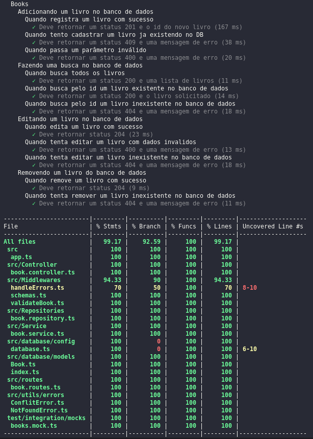

# Projeto Library Manager

> Status do projeto: Concluído :heavy_check_mark:

## Descrição do projeto

Nesse projeto foi desenvolvido uma API RESTful para gerenciamento de livros. Aqui podem ser feitas as seguintes operações:

- Adicionar um novo livro (nome, autor, editora, ano de publicação, número de páginas);
- Listar todos os livros;
- Buscar um livro pelo ID;
- Atualizar informações de um livro pelo ID;
- Deletar um livro pelo ID;

## Como rodar

- Clone o repositório 
```
git@github.com:GusCabraal/library-manager.git
```
- Instale as dependencias 
```
npm install
```
- Configure as variaveis de ambiente presentes no arquivo `.env.example`
- Rode o docker-compose
```
docker-compose up -d
```
- Entre no container node
```
docker exec -it books_api bash
```
- Rode a API
```
npm start
```
*Caso tenha algum problema de permissão negada com o comando acima, rode `chown -R root /app` e dê um novo `npm start`
- Acesse a API no localmente no endereço 
```
http://localhost:3001
```
- Você pode consumir a API importando o arquivo `routes-project.json` para dentro do Insominia

## Documentação

Foi realizada a documentação da API utilizando o [swagger](https://swagger.io/), a documentação pode ser acessada no [link](https://library-manager-production.up.railway.app/api-docs).


## Testes
Foram realizados testes de integração em todas as rotas da aplicação.

<summary><strong> Rodando os testes </strong></summary><br />

- Execute o comando:
 ```
 npm test
 ```




## Tecnologias utilizadas

- [Typescript](https://www.typescriptlang.org/)
- [Express](http://expressjs.com/)
- [Sequelize](https://sequelize.org/docs/v6/)
- [Postgres](https://www.npmjs.com/package/postgres)
- [Joi](https://www.npmjs.com/package/joi)
- [Supertest](https://www.npmjs.com/package/supertest)
- [Sinon](https://www.npmjs.com/package/sinon)
- [Swagger UI Express](https://www.npmjs.com/package/swagger-ui-express)
